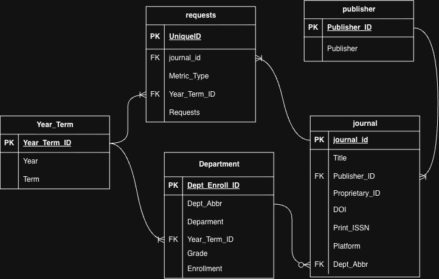
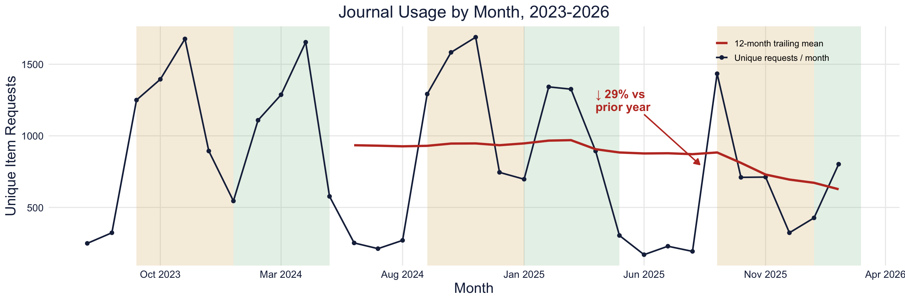

## The one-liner

> We integrated **journal request data and enrollment data** into **a normalized schema** so that
> **the Willamette Librarians** can **better understand their usage and make informed decisions about which online resources to maintain**.

**Role:** I spoke to our stakeholders, led the data wrangling process, contributed to the analysis, and worked on the final deliverables.  
**Team:** [Emily Strickland](https://emvstrick.github.io/) & [Tiffany Truong](https://tiffanytruong26.github.io/)  
**Repo:** [https://github.com/sophiarabb/data510-libraries](https://github.com/sophiarabb/data510-libraries)

## The question

The WU librarians had no way in the past few years to analyze the patterns of usage for the online resources which they maintain. These include journals and articles that anyone in the Willamette community can access and use. Our goal was to perform an analysis which could give insights into common usage patterns, and possibly lead to actionable suggestions about how to best determine which journals and departments should remain available.

## The data

Our data came from 2 sources: the Willamette library's usage request data, and the WU Factbooks, which contain enrollment data. Fortunately, all of our data was de-identified, so privacy was not a concern. The usage data has no information as to who borrowed the resource, and the enrollment data is includes only aggregated counts.

#### Usage Data

The usage data was supplied to us by our contact at the Willamette Libraries. It contained monthly data spanning July 2023 - March 2026 of the number of requests for each journal based on 2 metrics: total item requests, and unique item requests. The total item requests counts repeated views of the same article, and different publisher platforms inflate that count differently depending on how their interface serves PDFs and HTML full text. Unique item requests counts each article once per session, and was therefore a more reliable way to count usage. It was the primary metric for our analysis.

These journals came from a handful of publishers and needed to be hand-labeled with the department the journal best fit into, as we wanted to include department and subject matter in our analysis. This proved to be tedious as there were about 2,000 journals to label, many of which did not fir perfectly into one category. Journals that could've belonged to more than one subject were placed into the best fitting subject at the team's discretion, which was then coroborated by the WU library contact. All of the data was then combined into one file (as opposed to one file per publisher), ensuring the dates lined up as some files had variations in which months were available.

#### Factbooks

The factbooks data is publicly available data posted by the University. It can be viewed at [this site](https://legacy.willamette.edu/ir/factbooks/). This website tracks enrollment in each major every semester, broken down by grade and sex. We used both Spring and Fall data for the time our journal data spanned (Fall 2023 - Fall 2025). Spring 2026 was not yet available at the time of our data ingestion process. Since this data is hosted in an .html format, we wrote a script in order to pull all the necessary information into a .csv file so it was usable for us. The aggregates in the data were discarded in favor of our own calculations, and the sex variable was unimportant, and we summed together the enrollment to get the per-grade enrollment for each major.

#### Pulling it Together

The data was ingested into a Postgres database using staging tables, then inserted into the normalized schema seen below:

This allowed us to then export each table into a .csv file and store it in a shared drive. This allowed us to independently download the data and use it in our asynchronous analysis.

## The approach

We used exploratory analysis and descriptive statistics rather than predictive modeling — the stakeholder question was descriptive (which resources are used, by whom, how usage is changing), and with under three years of monthly data there wasn't enough history to train or validate a model honestly.

We looked into journal usage over time, average journal usage per enrolled student, and journal counts by department.

A few choices shaped what we could trust in these results. Oxford and Springer each supplied two overlapping export files rather than one continuous file, and concatenating all seven spreadsheets naively inflated total requests by about 4.4%; we deduplicated at the journal-and-term level, keeping the max value where files disagreed. We also found that publisher reports omit titles with zero requests rather than reporting a zero, so a blank cell means "not reported," not "no usage." That ruled out describing any journal as unused, and meant restricting our time series to the 1,493 journals that reported in every month of the window, so a coverage gap couldn't masquerade as a usage change.

For validation, we had no ground truth to compare against, so we leaned on robustness: the year-over-year usage decline held up even within publishers that only ever sent one continuous file, ruling out deduplication as the cause.

## Findings

### Journal Usage by Month

{fig-alt="Journal usage by month, July 2023 to February 2026. Unique item requests per month, summed across the 1,493 journals reporting in every month of the window (n = 1,493). The red line is the 12 month trailing mean. March 2026 is excluded because only one of five publishers reported that month." width="90%"}

This graphic shows monthly unique item requests from July 2023 to February 2026, for the 1,493 journals reporting in every month. March 2026 is excluded because only one publisher reported it. Usage follows the academic calendar, peaking mid-term and dropping to near zero over breaks, with Fall the highest of the three terms. Collection-wide usage declined 29% in the most recent year, from 787 to 556 unique requests per month. Because the journal panel is held constant and the decline appears within single-file publishers, it reflects real usage rather than a reporting gap. The isolated September 2025 spike is one newly activated journal, not a recovery. The seasonal timing is stable across all three years, so the decline is a change in level.

## The full write-up  

[Download the write-up (PDF)](projects/capstone/m4DRAFTwriteup.pdf){.btn .btn-primary}

<iframe src="projects/capstone/m4DRAFTwriteup.pdf" width="100%" height="800px"
  style="border: 1px solid #ddd;"></iframe>

## The full poster

[Download the poster (PDF)](projects/capstone/0802posterDRAFT.pdf){.btn .btn-primary}

<iframe src="projects/capstone/0802posterDRAFT.pdf" width="100%"
  style="aspect-ratio: 4 / 4; border: 1px solid #ddd;"></iframe>

## Dig deeper

- 📦 **Code & pipeline:** [Library Capstone Project Repository](https://github.com/sophiarabb/data510-libraries)
