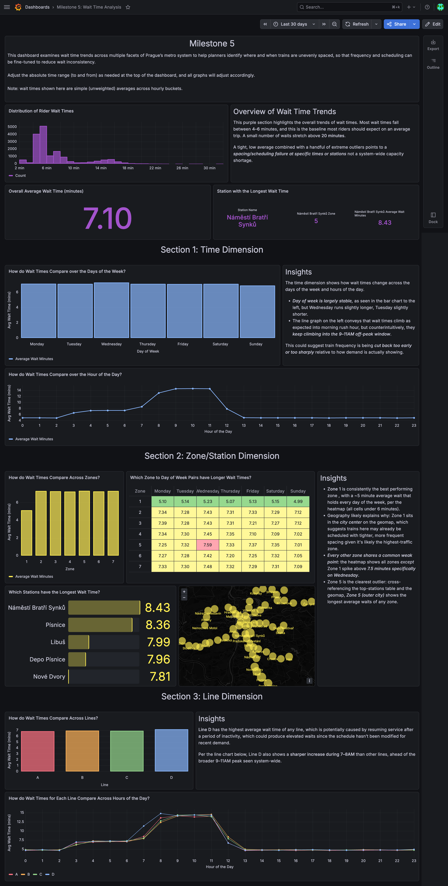

## What it is

This project consisted of creating an entire pipeline. There were several data sources: a relational database, a document database, an API, a graph database, and kafka events. As a group, we wrote Directed Acyclical Graphs (DAGs) to take snapshots of the data everyday, storing them in an s3 bucket. We then wrote another dependent DAG to pull the data into the data warehouse in staging tables. Data Buildter Tool (dbt) models were then written to transform the data into an appropriate schema depending on the business questions. Each schema consisted of a fact table and a few dimension tables. The fact tables held the primary metric of interest, typically aggregated (average wait time, number of rides, average time spent in the system). The aggregation depended on the business question. The dimension tables were then connected to the fact table by foreign and surrogate keys. These answered questions like who, what, where, and when. The dimension tables typically included things like time, station information, route information, fare type, etc. The dbt models would also run on a schedule, using a bash task within a DAG. This prepared the data for analysis and made for ease in joining tables together to address the variables of interest.

While there were many milestones, the below example answered questions about the wait times that passengers experienced, and how that varies depending on the time of day, day of week, line, zone and station.

Softwares used included Airflow, RustFS, neo4j, Grafana, and more.

## What I did

- Organized schema to ensure fact and dimension tables held all necessary information to address all facets of the business question.
- Built multi-step dbt models to transform data into the predetermined schema.
- Collaborated with team on how to display various aspects of the data and which pieces to highlight.

## Output

[Download the milestone (PNG)](bm5_last30days.png){.btn .btn-primary}

